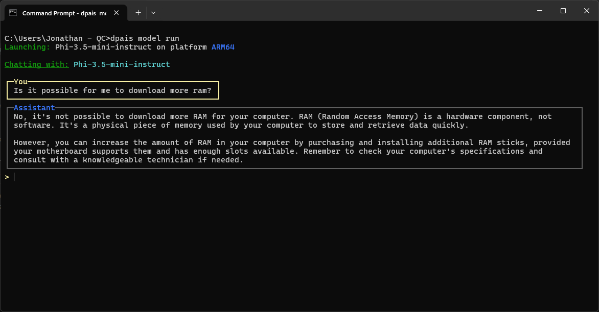

import { Steps } from 'nextra/components'

# Getting Started with Dell Pro AI Studio

Dell Pro AI Studio (`dpais`) offers a command-line-driven experience for quickly setting up and running AI models on supported Dell machines. This guide walks you through the basic setup: from installation to running your first model.

<Steps>

### Install the CLI

To install the Dell Pro AI Studio CLI, you can run the below command in Powershell or CMD (Downloads and installs cli):

```bash
powershell -Command "iwr https://dellupdater.dell.com/non_du/ClientService/endpointmgmt/dpais/cli/dpais-cli.x64.msi -OutFile $env:TEMP\dpais.msi; Start-Process msiexec -Wait -ArgumentList '/i',$env:TEMP\dpais.msi"
```
Note: You must open a new shell session after installing (adds to PATH)

Alternatively, download the MSI installer manually from [here](https://dellupdater.dell.com/non_du/ClientService/endpointmgmt/dpais/cli/dpais-cli.x64.msi) and follow the setup prompts.

After installation, ensure the CLI is accessible via your terminal by running:
```bash
dpais --version
```

### Initialize Dell Pro AI Studio
To set up your Dell Pro AI Studio environment, run the following command in your terminal:

```bash
dpais init
```

This command will help install necessary dependencies and prepare your system for running AI models. You will be prompted to select and install your first AI models during this process.

### 3. Run a Sample Model
To test your setup, you can run a sample model. Use the following command:

```bash
dpais model run
```
You'll get a in-terminal prompt to select a model, enter a query, and the model will generate a response.



</Steps>


## What's Next?

Read the How-To-Guides or [SDK examples](/interfacing-sdk) for more detailed information on interfacing with Dell Pro AI Studio to build AI applications.
